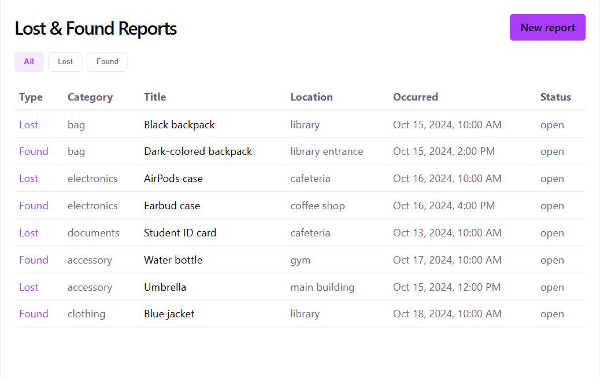
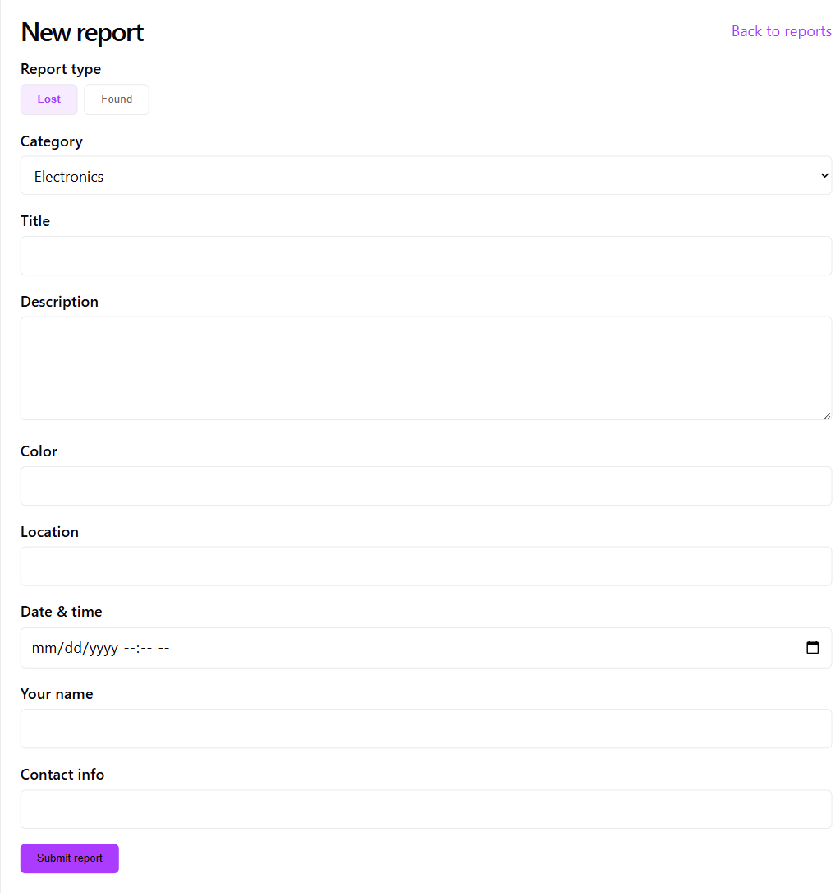
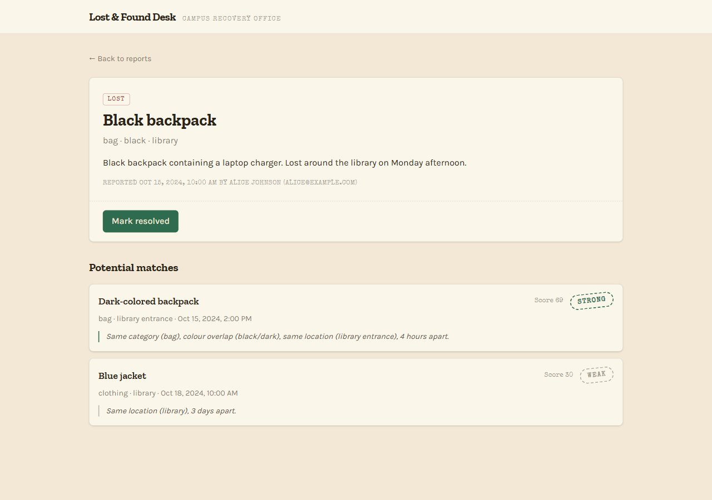
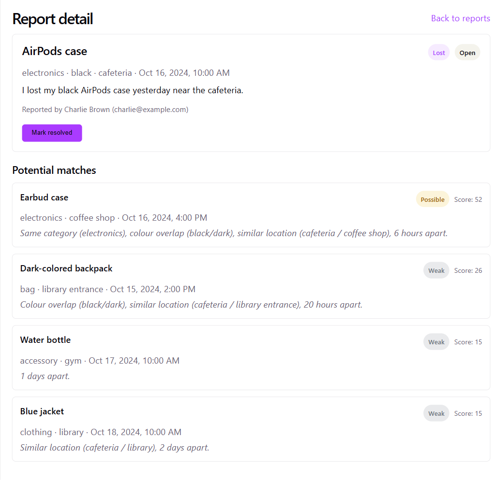
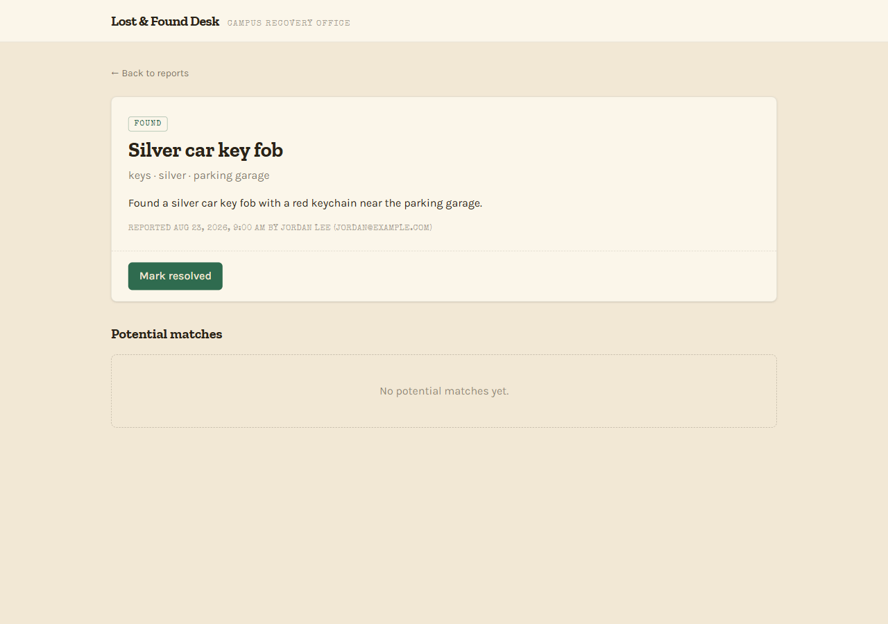

# Lost & Found Matcher

A submission for the Nemma Technologies take-home software engineering assessment: a small web
app for a university lost-and-found. Anyone can submit a **lost** or **found** item report, and
each report page shows a ranked, explained list of potential matches from the opposite list.

Stack: **FastAPI + SQLite** backend, **React + TypeScript (Vite)** frontend, talking over a small
JSON API.



## Approach taken

The brief's actual minimum bar is small — create lost/found reports, see potential matches —
and explicitly rewards "thoughtful, small" over "complicated, unfinished." Before writing any
code, I researched how this kind of matching problem is usually solved (deterministic
attribute/string matching, semantic text embeddings, LLM-judged comparison — see
[`approaches-and-assumptions.md`](approaches-and-assumptions.md) for the full write-up) and
settled on one governing design philosophy: **matching is advisory, not authoritative.** A human
still makes the final call on whether two reports are the same item, so the app's job is to
narrow a big pile of reports down to a short, ranked, *explained* shortlist — not to auto-resolve
anything. That one decision drives almost everything else: a low show/hide threshold that favours
recall over precision, a tiered score instead of a binary yes/no, and a plain-English reason
attached to every match instead of a bare number.

With that settled, the build went through three stages: design research and a written trade-off
comparison, a detailed implementation plan (data model, exact scoring formula, API contract,
page-by-page UI) written and approved before any code, and then implementation task by task. Data
model, matching scorer, API, and frontend were each built and tested independently before being
wired together.

Day to day, using the app is simple: browse the report list, submit a new lost or found report
through a short form, and open any report to see its ranked matches.



## Important assumptions made

- **No auth/accounts.** Reports carry a reporter name and contact field, but there's no login —
  out of scope for "keep it small."
- **No photo upload or image matching.** The whole system is text-only; see "What wasn't built."
- **Single university, one flat list of reports** — no multi-tenant support, no departments.
- **SQLite persistence** (via SQLModel) — enough to survive restarts without needing a full
  database server or Docker for an assessment of this size.
- **A fixed, small category taxonomy** (Electronics, Bag, Clothing, Accessory,
  Documents/Cards, Keys, Other) rather than free text, so structured scoring is tractable. The
  free-text description still captures anything the taxonomy misses.
- **Location is free text, fuzzy-matched** — not geocoded — on the assumption that a campus is
  small enough that string similarity between location names is a reasonable proxy for
  "nearby."
- **Date proximity, not strict ordering.** A found date before the lost date is treated as a
  weaker signal, not an automatic disqualifier, since misremembered dates happen.
- **A "potential match" is a ranked, tiered score, not a boolean** — mirroring the brief's own
  worked example, where a same-category item found far away and much later "may or may not" be
  a match.
- **Reports have a status** (`open`/`resolved`); resolving a report removes it from other
  reports' match lists, which felt like a cheap, meaningfully-more-realistic addition beyond the
  bare minimum.

## How the matching system works

Every open report of the opposite type (lost ↔ found) is scored against the report being viewed,
across five independently-scored components that sum to 100 points:

| Component | Weight | What it rewards |
|---|---|---|
| Category | 20 | Exact category match |
| Colour | 15 | Exact match (15), one colour name contained in the other e.g. "dark" in "dark blue" (10), or both in the same synonym group like dark ≈ black/navy/charcoal (8) |
| Location | 20 | Fuzzy string similarity between location text (`difflib`), boosted if one location contains the other |
| Date proximity | 15 | How close the lost and found timestamps are: ≤24h → full marks, decaying to 0 past a week |
| Text similarity | 30 | Semantic similarity between the two free-text descriptions |

The total score is bucketed into a tier: **Strong** (≥ 65), **Possible** (35–64), **Weak**
(15–34), or **Hidden** (< 15). Hidden matches are dropped from the API response entirely and
never shown to the user — the threshold for showing a pair at all is set deliberately low (favour
recall), but pairs with essentially zero relevance are still filtered out rather than cluttering
the list.

Text similarity is the one component that isn't a plain rule: it uses a local embedding model
(`fastembed`, `BAAI/bge-small-en-v1.5`) to embed each report's title + description and compares
them by cosine similarity. That raw cosine similarity doesn't sit near 0 for unrelated text with
this model, so rather than thresholding it directly, the score is rescaled against a calibrated
`FLOOR` constant (`0.748`), chosen from measured cosine values on the brief's own example pairs —
about 0.69 for a genuinely unrelated pair, about 0.80 for a genuinely related one.

Every match is also rendered as a plain-English reason string built only from the components that
actually contributed — a component that scored 0 is simply omitted, never listed as a miss. For
example:

> "Same category (bag), colour overlap (black/dark), same location (library entrance), 4 hours
> apart."

Verified end to end against the assessment brief's own worked examples: the library/backpack pair
scores **Strong (65)** (`category=20 color=8 location=16 date=15 text=6`), and the
AirPods-case/earbud-case pair scores **Possible (52)** (`category=20 color=8 location=8 date=15
text=1`). Looking at the actual breakdown, the embedding component's contribution on these two
specific pairs is small — 1/30 and 6/30 — because the rule-based components already carry most of
the signal on short descriptions like these (both pairs share category, colour, and a
location/date match without any help from the text score). The backpack pair's "Strong" result
does depend on those 6 points to clear the 65 threshold (59/100 without them would be "Possible,"
not "Strong"), and the AirPods pair would still score "Possible" (51) with the text component
removed entirely — rules alone already catch it via category + colour + date + location. At this
data scale the embedding's real value is more about the vocabulary-mismatch cases it's *designed*
to catch (see the design doc) than what these two seeded examples happen to demonstrate — see
"What I'd improve" below.




A report with nothing above the Hidden threshold simply shows no candidates, rather than forcing
a low-quality match onto the list:



## Major technical decisions

- **FastAPI + SQLite** for the backend: a fast, dependency-light combination well suited to a
  scoped assessment — no database server or container setup required, but a real persistence
  layer with a proper ORM (SQLModel) rather than an in-memory list.
- **Hybrid rule-based + embedding scoring**, not pure rules or pure ML. Pure rule-based matching
  is fully deterministic and explainable but brittle to vocabulary mismatches (an "AirPods case"
  vs. an "earbud case" share no words). Pure embedding or LLM-judged matching catches those
  semantic matches but produces a score that's hard to turn into an honest "why," and an
  LLM-judged approach would additionally require an API key — a risk for anyone trying to run
  this submission from scratch. The hybrid keeps four of the five components fully rule-based and
  explainable, and confines the embedding model to the one component (free-text similarity) where
  it earns its keep.
- **`fastembed` over `sentence-transformers`** for that embedding component specifically because
  it's ONNX-based rather than PyTorch-based — a much lighter, faster install for a reviewer
  running `pip install` from a clean checkout.
- **Separate React frontend + FastAPI backend**, rather than a single full-stack framework, for
  clean separation of concerns and because it's a widely-understood pattern that's easy to run and
  review independently.

## What wasn't built (intentionally deferred)

- Photo upload and image similarity matching (perceptual hashing or CLIP-style embeddings).
- A proper synonym/ontology system for colours, categories, or brands — only a small hardcoded
  colour synonym table exists.
- An admin workflow: confirming/rejecting a match, notifying both parties, or auto-closing
  resolved reports (reports can be marked resolved, but nothing beyond that).
- Real geolocation (lat/long + radius) in place of fuzzy string matching on location names.
- Authentication, per-user report ownership, and rate limiting/abuse handling.
- Pagination and search — the report list assumes a demo-sized volume of reports.
- CI and a broader automated test suite. Targeted unit tests exist for the scoring function and
  the API (26 tests total), which felt like the higher-value spend for this scope, but there's no
  CI pipeline running them automatically.

## What I'd improve for a real product

- Swap in a real synonym/ontology lookup (or a small curated dictionary per category) instead of
  the current three-entry colour synonym table, so more vocabulary mismatches are caught without
  leaning on the embedding component alone.
- Add photo upload with basic image similarity as a second matching signal — many real lost items
  are visually distinctive in a way text descriptions understate.
- Build the admin/resolution loop properly: notify both reporters when a Strong match appears,
  let a staff member (or the reporters themselves) confirm or reject it, and auto-close both
  reports on confirmation.
- Make the matching backend genuinely swappable (it's already isolated behind `score_pair` /
  `tier_for_score` / `build_reason`, but there's no formal interface) so a future embeddings-only
  or LLM-judged strategy could be dropped in without touching the API or frontend.
- Add pagination, filtering, and search once report volume grows past a demo-sized list, plus
  proper auth so reports are tied to real university accounts.
- Wire up CI to run the existing test suite on every push, and extend coverage past the scoring
  and API layers to the frontend.

## AI usage

This project was built with Claude Code across one continuous session, and AI was used
deliberately at every stage rather than just for code generation. It started with research: I
asked Claude to look into how lost-and-found matching problems are typically solved and lay out
the real trade-offs between rule-based scoring, embedding similarity, and LLM-judged comparison.
We went back and forth on that trade-off in particular — I pushed on whether embeddings alone
would be simpler, and we converged on the hybrid design specifically because it keeps the scoring
explainable while still catching cases pure rules would miss. I set the core design philosophy
myself (matching as advisory rather than authoritative, favouring recall, and requiring every
match to carry a reason) and that shaped the tier thresholds and the reason-string format Claude
then implemented. From there, Claude wrote a full implementation plan — exact data model, exact
scoring weights, exact API contract — which I reviewed and approved before any code was written.

Implementation itself followed a subagent-driven workflow: each of the plan's twelve tasks was
handed to a fresh AI subagent to implement (with tests written first where the plan called for
TDD), and a second, independent subagent then reviewed that task's diff against its actual
requirements before the next task started. That review step caught several real problems before
they reached the final codebase — the frontend was initially scaffolded from the wrong Vite
template and had to be rebuilt; the colour/location scorer had a genuine bug where a blank field
would score as a false partial match (a Python quirk where an empty string tests as a substring of
everything), caught and fixed with a regression test added; the text-similarity scorer initially
shipped with no test exercising its positive-score path, which review flagged and a fixture was
added for; and the seed data initially paraphrased the assessment brief's own worked examples
instead of reproducing them verbatim as the plan required, which review caught and corrected. I
reviewed and signed off on the design and the plan at each stage rather than letting either run
unsupervised.

## Running it locally

Requires Python 3.11+ and Node.js with [pnpm](https://pnpm.io/installation) (this project uses
pnpm, not npm).

### Backend

```bash
git clone <this-repo-url>
cd "Lost And Found Matcher/backend"

python -m venv .venv
# Windows (PowerShell):
.\.venv\Scripts\Activate.ps1
# Windows (cmd.exe):
.venv\Scripts\activate.bat
# macOS/Linux:
source .venv/bin/activate

pip install -r requirements.txt
python -m app.seed          # creates backend/data/app.db and seeds 8 demo reports
uvicorn app.main:app --reload --port 8000
```

The API is now running at `http://127.0.0.1:8000` (interactive docs at
`http://127.0.0.1:8000/docs`).

> **PowerShell note:** if `Activate.ps1` fails with a script-execution error, run
> `Set-ExecutionPolicy -Scope Process -ExecutionPolicy Bypass` first, then retry. Or skip
> activation entirely and call the venv's binaries directly:
> `.\.venv\Scripts\python.exe -m app.seed` and `.\.venv\Scripts\uvicorn.exe app.main:app --reload --port 8000`.

Note: the text-similarity component uses a local embedding model (`fastembed`,
`BAAI/bge-small-en-v1.5`, ~130MB) that's downloaded from HuggingFace on first use rather than at
`pip install` time. That download happens automatically at `uvicorn` startup (before the server
starts accepting requests), so it needs network access and can take a moment the very first time
you run the backend — after that it's cached locally and subsequent startups are fast.

#### Running the tests

```bash
cd backend   # tests must be run from the backend/ directory
# .venv already activated from the steps above
pytest
```

### Frontend

In a second terminal:

```bash
cd "Lost And Found Matcher/frontend"
pnpm install
pnpm dev
```

The app is now running at `http://localhost:5173`. The frontend expects the backend on
`http://localhost:8000`; both need to be running at the same time.

---

*Run instructions above were verified from a clean shell against this exact checkout: a fresh
`pip install -r requirements.txt`, a from-scratch database seed (8 reports created), `uvicorn`
serving `/reports` and `/reports/{id}/matches` correctly (including a live check that the
embedding model download completes cleanly at startup), `pytest` passing all 26 tests from
`backend/`, and `pnpm install` + `pnpm dev` serving the frontend on port 5173.*
